# 👻 GhostVOD Engine for Stremio & Nuvio

  

  <b>Combine Multiple XC API / M3U Media Playlists into One Unified, Clean Catalog!</b>

If you manage one or multiple remote media playlists or personal video servers, you probably hate having to switch to a clunky third-party player just to watch a movie. Stremio and Nuvio are the ultimate media centers, so why not bring your personal remote VODs directly into them, fully cleaned and organized alongside your Debrid links?

GhostVOD is a lightweight, privacy-focused cloud engine that acts as a bridge between your custom data providers and your media app. It completely ignores linear live feeds and focuses strictly on VOD (Movies & Series).

  
   
  If you find GhostVOD useful and want to help cover server costs and ongoing maintenance, consider buying me a coffee! Any support is deeply appreciated.

  

  💬 Join our official subreddit to share feedback, request features, report bugs, or discuss the latest updates!

---

## 🚀 What's New in v2.1.5

### 🌐 Per-Provider Custom User-Agent
* **Bypass Provider Restrictions:** Some IPTV/Xtream Codes providers enforce user-agent checks and restrict requests only to their official apps or specific players.
* **Dedicated Input Field:** Added an optional **Custom User-Agent** field inside each server card on the dashboard. You can now emulate any player or client required by your provider. Leaving it blank maintains the clean default browser user-agent.
 
 

  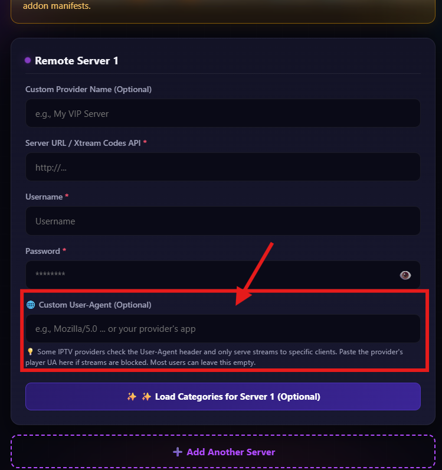
   
  <em>New "User-Agent" field to emulate specific players required or restricted by certain IPTV providers. You can leave it blank if this doesn't affect you.</em>

### 🌎 Latin American Spanish (Español Latino) Support
* **Independent Stream Sorting (`eslat`):** Added a dedicated sorting option for **Spanish — Latino (Español Latino)**. It accurately detects and prioritizes Latin American audio/dubs (`LATINO`, `LAT`, `MX`, `LATAM`) separately from European Spanish (Castilian).
* **Multi-Language Metadata Matching (`es-LA`):** Added `es-LA` to translated title matching, mapping across TMDB regional translations (`es-MX`, `es-AR`, `es-CO`, `es-CL`, etc.) so regional titles match seamlessly with English/original metadata.

### 🔗 Community & Support
* Added official community links in the dashboard footer, including our subreddit at [r/GhostVOD](https://reddit.com/r/GhostVOD).

---

## ✨ What's New in v2.1.4

* **🎯 "Use strict word comparison only" Toggle:** Added a new optional setting in the dashboard for cleaner, more accurate results. 
  * **When enabled:** It enforces strict title matching to eliminate clutter, completely preventing unrelated movies or other parts of a franchise from spilling into your stream list (e.g., searching for *Spider-Man: Homecoming* won't pull up every other Spider-Man movie).
  * **Trade-off to keep in mind:** Because it requires an exact word match, it might miss titles if your provider uses heavy abbreviations or omits main words (e.g., listing just *"Chapter 2"* instead of *"John Wick: Chapter 2"*). If your provider has clean, full titles, leave this enabled; if their catalog uses erratic or truncated names, keeping it disabled will ensure maximum recall.
 

  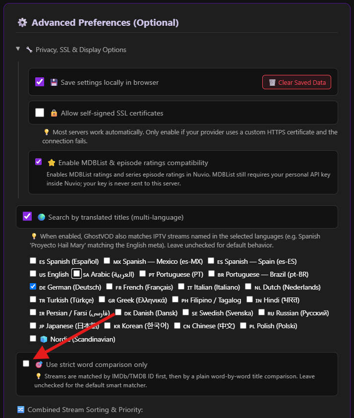
   
  <em>New "Use strict word comparison only" toggle in the configurator settings under "Advanced Preferences".</em>

* **Faster Stream Resolution:** Significantly optimized internal title lookups, cutting down processing latency so your stream links appear noticeably faster when clicking any movie or episode.
* **Security & Reliability Hardening:** Strengthened network connection lifecycles, prevented background task stalls, and improved memory handling to keep the engine fast and rock-solid under load.
* **Smarter Title Matching:** Improved sequel numeral handling, better abbreviation reconciliation, and enhanced Unicode support for non-Latin and localized titles.

---

## ✨ What's New in v2.1.3

* **Improved Provider Compatibility:** Enhanced support for various IPTV providers and strict firewalls, ensuring smoother connection and fewer loading errors.
* **Smarter Background Fetching:** Significantly optimized how the addon communicates with providers, reducing server load and improving overall response times.
* **Faster & More Reliable Streams:** Upgraded failover systems to deliver quicker stream links and prevent buffering delays during peak hours.
* **General Fixes & Stability:** Minor bug fixes, improved error handling, and performance optimizations across all catalogs.

---

## ✨ What's New in v2.1.2

GhostVOD v2.1.2 introduces smart multi-language translated title matching for localized streams, alongside extensive security and stability improvements.

---

### 🌍 Multi-Language Search & Translated Title Matching

* **Match Localized Titles:** You can now enable matching for IPTV streams named in other languages against official TMDB movie and series titles. For example, searching for an English title will accurately find your provider's streams even if they are named in Spanish (*Proyecto Hail Mary*), French, German, or other languages.
* **Dashboard Language Selector:** Choose and customize your preferred search languages directly from the advanced preferences in the dashboard.

  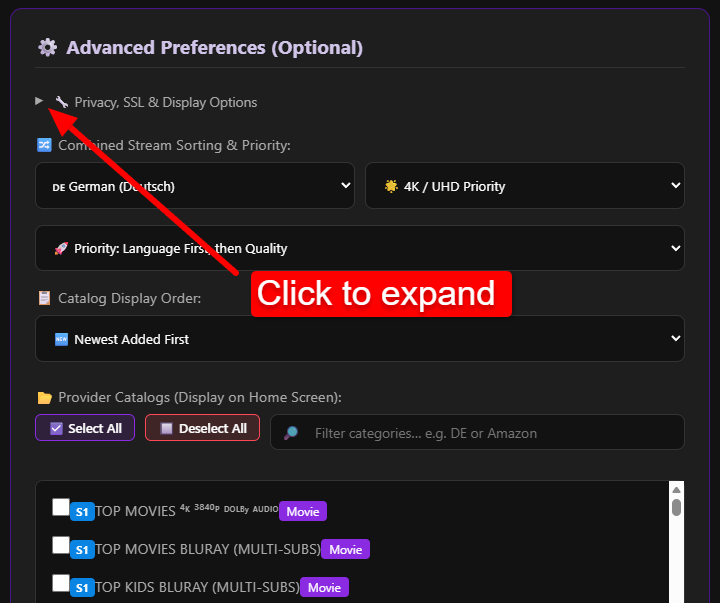
  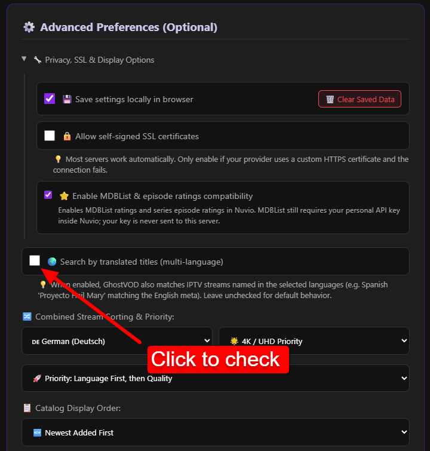
  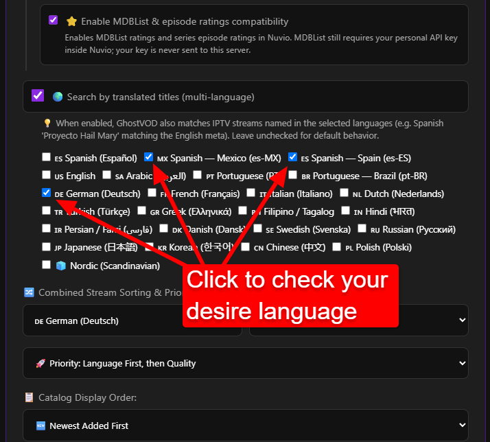

https://github.com/user-attachments/assets/b3b7a1bb-b15e-473a-9d58-b5e35283f9a4

---

### 🛡️ Security & Performance Enhancements

* **Comprehensive Security Hardening:** Applied numerous security patches, input validations, and stricter network safeguards across the engine to protect your server environment.
* **Overall Stability Improvements:** Enhanced system resilience and continuous background operation to ensure a smoother, interruption-free streaming experience.

---

## ✨ What's New in v2.1.0 (Massive Overhaul)

GhostVOD v2.1.0 introduces a complete architectural rewrite focusing on ultimate privacy, metadata enrichment, and tight integration with NuvioTV's native UI features.

### 🔒 Ultimate Privacy & "Stateless" Links

You asked for it! You can now generate a **Stateless Long Link**. Your credentials are AES-256 encrypted directly into the URL itself. Absolutely *nothing* is stored on our databases. GhostVOD acts purely as an invisible bridge. If you prefer a short link, your configuration is now deeply encrypted on the server before being saved.

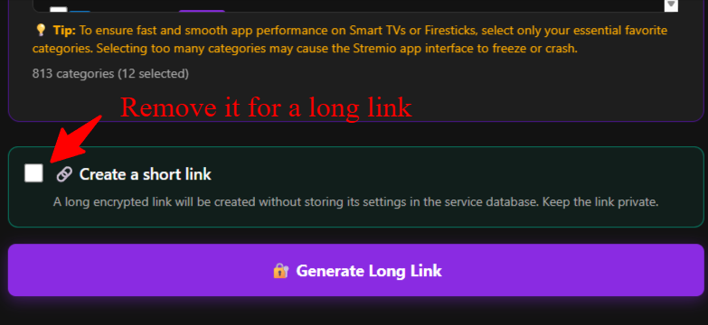

### 🎬 Massive Metadata & Visual Upgrades (NuvioTV Exclusive)

* **Full Cast & Photo Support:** Remember when the addon only showed 3 blank circles with just names for your VOD content? For any movie or series folder you load from your provider, the engine now fully supports Nuvio’s native cast feature, successfully pulling up to 18 cast members complete with their actual profile photos!

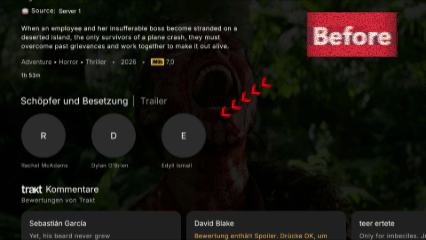

* **MDBList & Multi-Source Ratings:** Enable MDBList compatibility directly from the GhostVOD dashboard! This fully unlocks the ability to see ratings from various sources right above the descriptions, as well as individual episode ratings. *(Note: You still need to enable MDBList and enter your personal API key safely inside Nuvio's settings).*

  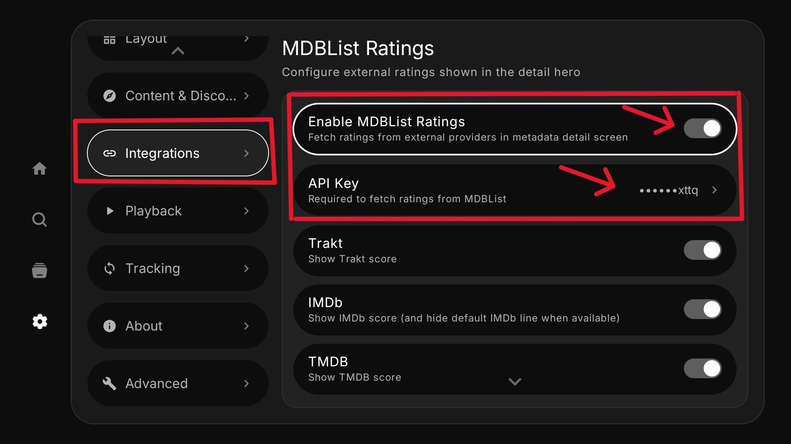
  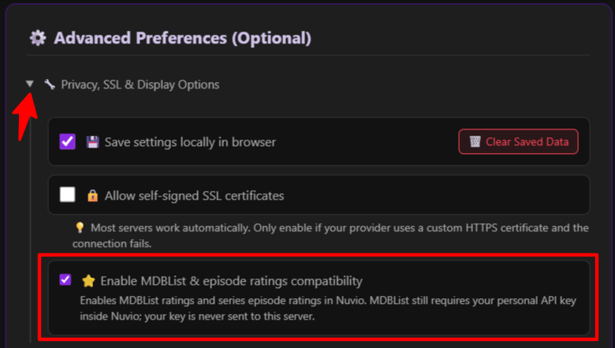
  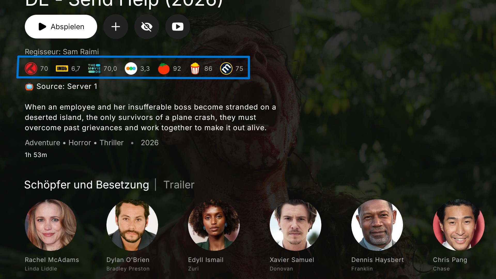
  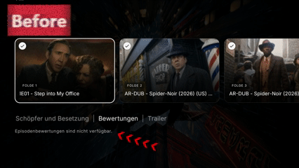

### ⚡ Instant Rich Details & Smart Filtering

* **Hover Details:** Hover over any card from your selected Provider catalogs and instantly get enriched plots, genres, and accurate runtimes. The engine dynamically combines data from your Provider, Cinemeta, and TMDB in the background.

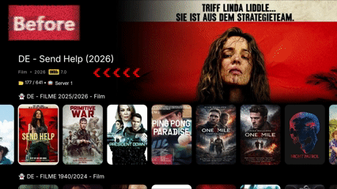

* **Instant Folder Filtering:** Have a provider with 500+ folders? There’s now a lightning-fast search bar in the dashboard to instantly filter and select exactly the categories you want.

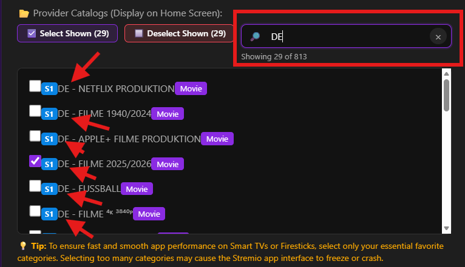

---

## 🚀 Core Features (Stremio & NuvioTV)

🔀 **Advanced Content Sorting:** Take full control of your library's layout directly from the configuration portal. You can now sort your catalogs by Newest Added, Oldest Added, Alphabetically (A-Z), or strictly keep the Provider's Default order.

🌍 **Expanded Language Sorting:** Prioritize your stream results based on 13+ languages including Filipino (PH), Hindi (IN), Persian (IR), Danish (DA), Swedish (SV), Portuguese/Brazilian (PT/BR), Russian (RU), Arabic, Spanish, French, and more.

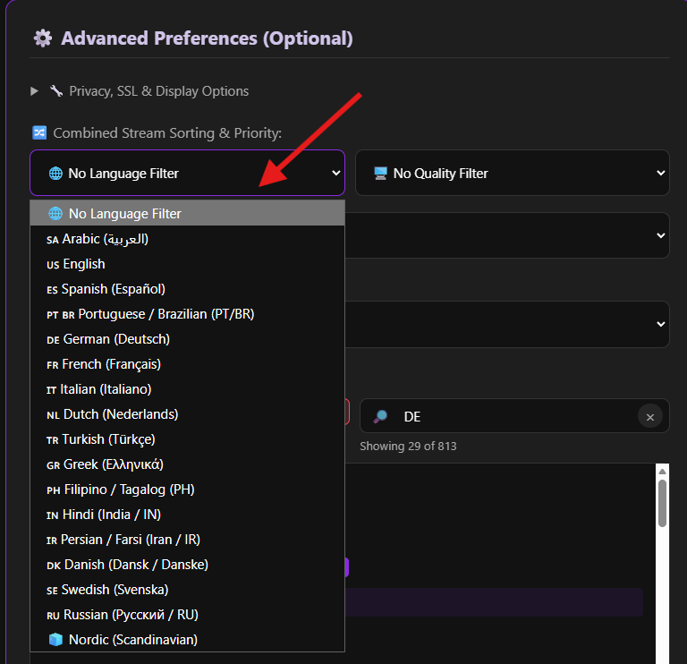

🎯 **Ultra-Precise Search Accuracy:** We've completely overhauled the search and matching algorithms. The engine now uses strict title extraction, successfully bypassing provider prefixes and complex subtitles. This significantly improves accuracy and almost entirely eliminates false positives.

📂 **Smart Native Episode Support:** Intelligently parses and renders real TV series seasons and episodes directly inside the interface, instead of stacking them unorganized in the source list.

📋 **Instant M3U Extraction:** Paste either your Xtream Codes API credentials OR a full M3U Playlist URL. The engine instantly extracts the credentials on-the-fly.

✅ **Smart Bulk Category Selection:** Pin specific provider folders to your home screen! You now have full freedom to select all categories (up to 1,000) using the "Select All" toggle. An elegant smart warning will alert you if your provider has over 50 categories, letting you proceed at your own risk while keeping your app interface lightweight.

📝 **Custom Provider Aliases:** Label your servers with custom names (e.g., "My Backup Server") to display directly on your screen instead of exposing raw domain names.

🛡️ **Enterprise-Grade IPTV Firewall Shield (Anti-Ban):** Built-in strict SSRF protection, XSS prevention, query rate-limiting, and concurrent request queues ensure that your IPTV provider is never spammed with heavy requests, keeping your subscription 100% safe.

💾 **Local Settings Manager:** Securely save your configuration setup locally in your browser's storage for easy future edits.

---

## 🚀 How to Use (Free Web Dashboard)

You do not need to download or install any files to use GhostVOD. Simply visit our Web Dashboard, configure your server, and generate your Magic Link to install directly into Stremio/Nuvio:

👉 **[Click Here to Open GhostVOD Dashboard](https://ghostvod.online)** 👉 **[Or the official public Stremio Addons index](https://stremio-addons.net/addons/ghostvod)**

*💡 Tip: If you are upgrading from an older version, it is highly recommended to visit the dashboard, generate a fresh link with your preferred options, and replace the old one in your app to experience all the new features!*

---

## 💬 Frequently Asked Questions (FAQ)

**Q1: Can I use an M3U link, or does it only accept Xtream Codes?** 

A: You can use either! Our dashboard allows you to paste a full M3U Playlist URL. The engine will instantly and automatically extract the server URL, username, and password from it.

**Q2: Do I *have* to fetch and add provider catalogs to my home screen to see my VODs?** 

A: Not at all! If you prefer a clean home screen, you can skip adding categories completely. GhostVOD operates silently in the background (Streams-Only Mode). Whenever you search for or click on any movie/series, GhostVOD will automatically fetch and display your provider's streams in the source list.

**Q3: Will using GhostVOD cause my IPTV provider to ban or block my subscription?** 

A: Absolutely not; your account is 100% safe. GhostVOD is built with an "IPTV Firewall Shield." It uses an aggressive caching system (saving lists for 24 hours) and a strict request queue. Even if hundreds of users click the same movie, your provider only receives *one* single request. GhostVOD acts as a protective shield for your provider, not a burden.  
*Please note:* Most IPTV providers strictly limit subscriptions to **one single active stream at a time**. Attempting to stream on multiple devices simultaneously may cause your provider to suspend your account, unless extra connections are purchased. This is a standard provider policy regarding concurrent streaming and is entirely unrelated to GhostVOD.

**Q4: Why wouldn't I just use a traditional player (like TiviMate) for my Xtream codes?** 

A: Traditional players are unbeatable for Live TV! But for VOD, Stremio/Nuvio’s ecosystem, metadata tracking, and UI are simply on another level. GhostVOD is built specifically to leverage your existing private VOD libraries inside a modern cinematic interface.

**Q5: Does it fetch stream quality and metadata? How does quality display work?** 

A: Yes! The engine dynamically extracts the resolution (e.g., 4K, 1080p) and any audio tags directly from your provider's stream title and displays them clearly as visual badges in the stream selection list before you play.

**Q6: Does it auto-update when my provider adds new movies or episodes?** 

A: Yes! GhostVOD queries your providers' APIs dynamically. The moment your provider updates their server with new content, it will automatically become searchable and ready to stream in your app within **24 hours** (matching our optimized cloud caching cycle). No manual syncing or link generation is ever required on your end.

**Q7: Do I need to generate a new Magic Link every time GhostVOD updates to a new version?** 

A: No! GhostVOD core updates (like performance boosts or anti-ban features) are processed completely on our cloud backend. Your existing Magic Links will continue to work seamlessly and automatically benefit from the latest upgrades without any action required on your end. *(Note: For major structural updates like v3.0.0, a new link might be required to unlock specific new UI features).*

**Q8: Does it support Stalker/MAC portals?** 

A: No. GhostVOD strictly accepts Xtream Codes API credentials and M3U links.

**Q9: Does this pull Live TV channels?** 

A: No, to keep your interface clean and fast, GhostVOD intentionally filters out Live TV and focuses 100% on VODs (Movies and Series). Use dedicated players for your live broadcasting needs.

**Q10: Is this open-source? Can I self-host it?** 

A: Not yet, but it is officially on the roadmap! I am currently preparing a lightweight open-source version specifically designed for self-hosting.

---

**⚖️ Disclaimer:** *GhostVOD is a pure software engine/tool. We do not host, provide, or stream any media content, nor do we sell streaming subscriptions or access codes. Users are solely responsible for their own media sources and compliance with local laws.*

  

